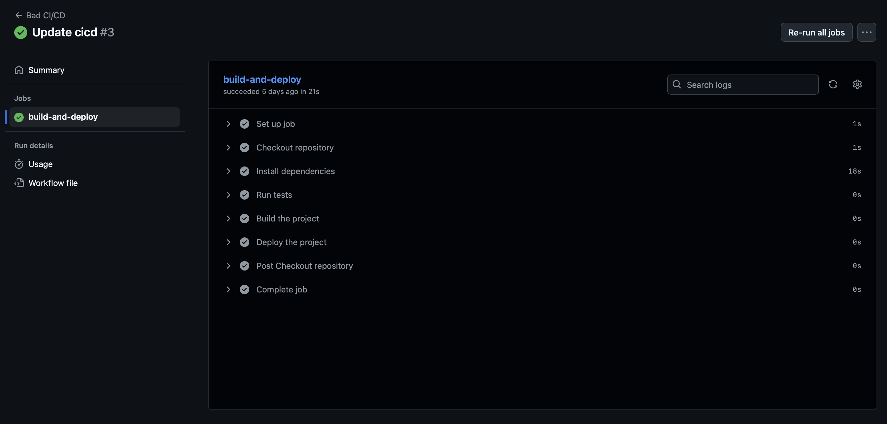
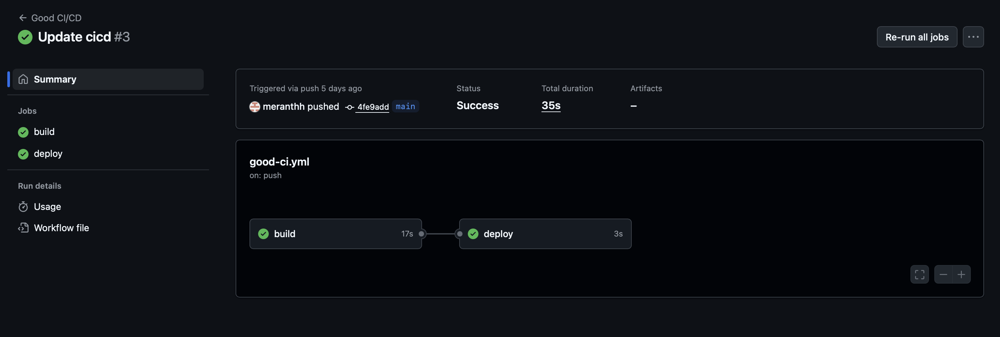

# Лабораторная работа №3
## Что происходит?
Нашей задачей было написать "плохой" и "хороший" CI/CD файл, в которых описать не менее трех bad practices и как мы их исправили вдальнейшем. А также, реализовать пункты 1-4 из кейса №5

Рубрика: объясняем на котятах🐈


# Часть 1

## "Плохой" CI/CD файл
```
name: Bad CI/CD

on:
  push:
    branches:
      - main

jobs:
  build-and-deploy:
    runs-on: ubuntu-latest
    steps:
      - name: Checkout repository
        uses: actions/checkout@v3

      - name: Install dependencies
        run: npm install

      - name: Run tests
        run: npm run test

      - name: Build the project
        run: npm run build

      - name: Deploy the project
        run: |
          echo "Deploying the project..."
```

## "Хороший" CI/CD файл
```
name: Good CI/CD

on:
  push:
    branches:
      - main

jobs:
  build:
    runs-on: ubuntu-latest
    steps:
      - name: Checkout repository
        uses: actions/checkout@v3

      - name: Cache node_modules
        uses: actions/cache@v4
        with:
          path: ~/.npm
          key: ${{ runner.os }}-node-${{ hashFiles('**/package-lock.json') }}
          restore-keys: |
            ${{ runner.os }}-node-

      - name: Install dependencies
        run: npm install

      - name: Run tests
        run: npm run test

  deploy:
    needs: build
    runs-on: ubuntu-latest
    steps:
      - name: Checkout repository
        uses: actions/checkout@v3

      - name: Deploy the project
        run: |
          echo "Deploying the project..."
        env:
          DEPLOY_SECRET: ${{ secrets.DEPLOY_SECRET }}
```

## Котята объясняют!
### 1. Кэширование зависимостей

**❌Trouble:** В первом файле CI/CD отсутствует механизм кэширования зависимостей. Это приводит к тому, что зависимости загружаются заново при каждом запуске, что увеличивает время сборки.

**✅Solution:** Во втором файле добавляем кэширование зависимостей с использованием `actions/cache`, что позволяет сохранить скачанные пакеты между сборками и значительно ускоряет процесс!

```yaml
- name: Cache node_modules
  uses: actions/cache@v2
  with:
    path: ~/.npm
    key: ${{ runner.os }}-node-${{ hashFiles('**/package-lock.json') }}
    restore-keys: |
      ${{ runner.os }}-node-
```


### 2. Установка зависимостей

**❌Trouble:** В первом файле используется команда `npm install` для установки зависимостей. Она может устанавливать разные версии пакетов, если они обновлены, что приводит к непредсказуемым результатам.

**✅Solution:** Во втором файле используем команду `npm ci`, которая гарантирует установку зависимостей именно тех версий, которые указаны в `package-lock.json`, что делает процесс сборки более стабильным и быстрым🚀

```yaml
- name: Install dependencies
  run: npm ci
```


### 3. Хранение артефактов сборки

**❌Trouble:** В первом файле отсутствует сохранение артефактов сборки, что может вызвать проблемы на дальнейших этапах, например, при тестировании или деплое.

**✅Solution:** Во втором файле добавляем сохранение артефактов сборки, что позволяет использовать их на следующих этапах CI/CD😎

```yaml
- name: Save build artifacts
  uses: actions/upload-artifact@v3
  with:
    name: build-artifacts
    path: ./dist
```


### 4. Безопасное использование секретов для деплоя

**❌Trouble:** В первом файле деплой выполняется без использования секретов или переменных окружения для хранения конфиденциальных данных, что может привести к утечке информации😟

**✅Solution:** Во втором файле деплой использует секреты, передавая их в переменные окружения, что гарантирует нам безопасность данных🤭

```yaml
- name: Deploy the project
  run: echo "Deploying the project..."
  env:
    DEPLOY_SECRET: ${{ secrets.DEPLOY_SECRET }}
```

 *злоумышенник*

### 5. Зависимости между стадиями

**❌Trouble:** В первом файле стадии `test` и `deploy` не зависят друг от друга, что может привести к тому, что деплой выполняется без успешного завершения тестов. 

**✅Solution:** Во втором файле добавляем зависимость между стадиями с помощью `needs`, что гарантирует (стопудняк), что деплой будет выполнен только после успешной сборки и прохождения тестов💪

```yaml
jobs:
  deploy:
    needs: build
    runs-on: ubuntu-latest
    steps:
      - name: Deploy the project
        run: echo "Deploying the project..."
```


## Что мы имеем?

### Пайплайн "плохого" CI/CD:



### Пайплайн "хорошего" CI/CD:




# Часть 2
Часть 2 см. в отдельном отчете в папке `solutions` Case №5!

